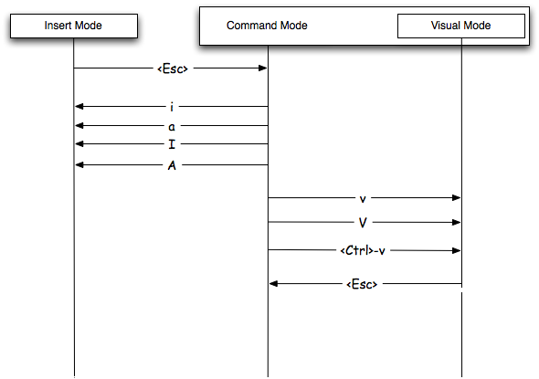

```{r setup, include=FALSE}
knitr::opts_chunk$set(echo = TRUE)
```

### Introductory Computing 1

- R/RStudio
    - Download and Install
    - Basic commands
    - Getting Help
    - Bioconductor
    - Data manipulation
        - Introduction to dplyr
        - filter, summarize, groupby, mean
        - Pipe `%>%`
    - Plotting
- Bash scripting
    - Getting help
    - STDIN/STDOUT, pipe
    - Math
    - Variable
    - Conditional
- Please signup for Odyessy!

[link to setup](https://docs.google.com/forms/d/e/1FAIpQLSc4JNuvRpNUO5kNbvF1gLWI8UOp34pwZhIf6Okwf7YoH4ymeQ/viewform)

---


Next week:

### Introductory Computing 2

- Python File Parsing
- A Trip to Odyssey
    - BWA and STAR
- HW1 Questions

---

#### Intro to R

This is an R Markdown document that I have output to an HTML presentation. Markdown is a simple formatting syntax for producing HTML, PDF, and MS Word documents. For more details on using R Markdown see <http://rmarkdown.rstudio.com>.

Each homework will be completed in this format and you will submit both the markdown document with code (.Rmd) and the compiled document (.html). With this format all necessary code (including python code!) may be included in one source and the graders may easily reproduce your results.

Homework files will be provided in several sources depending on thir type/size. Canvas will contain the problem sets and you will submit your completed homework here. GitHub will also contain the problem sets as well as necessary (small) datasets, etc. The Odyssey cluster will contain larger datafiles (/n/stat115/) and will be necessary for high performance computing later in the semester.

But first, let's get R/RStudio downloaded!

[Download R](https://www.r-project.org/)
[Download Rstudio](https://rstudio.com/products/rstudio/)

---

Before we get into knitting, let's consider the concept of a working directory.

```{r, eval=FALSE, echo=TRUE}
# where am I
getwd()

# change where I am (use the RStudio Session > Set Working Directory >
# To Source File Location)
setwd("~/Downloads/")

```

---

We often want to install packages to add some extra functionality on top of base R (https://cran.r-project.org/). To do so, we need to know the name of the package (often found via a google search) and we need to install it. Once installed, we need to load the package into the namespace. 

Let's try to install the `nycflights13` package.

```{r, eval=FALSE,echo=TRUE}
install.packages("nycflights13")
install.packages("ggplot2")
install.packages("dplyr")
```

Load the packages using the `library` command.

```{r}
library(nycflights13)
library(ggplot2)
library(dplyr)
```

Now make sure to open the markdown document and follow along! Download either from canvas or from (https://github.com/stat115/Lab1).

---

#### Quick GitHub Detour

GitHub is a version control system that we will be using primarily as a repository for the homeworks and labs. It is a great tool and we recommend learning and utilizing GitHub for your own work. Lots of tutorials are available such as (https://guides.github.com/activities/hello-world/). 

You will only be required to download the homework files and labs but there are many more features worth learning (commiting, branching, etc.). But first, let's download the lab files.

---

#### Quick GitHub Detour

- First, register for an account (https://github.com/join)
    - Students get some great extras free for two years as well (https://education.github.com).

- Navigate to the stat115 github page (https://github.com/stat115/)

- Click on the Lab 1 repository

- Click the "Clone or download" button.
    - Either Download Zip and open in finder/explorer. Open in RStudio.
    - Alternatively, copy the URL to the clipboard (https://github.com/stat115/Lab1.git). Switch to RStudio. Click the "Project (None)" button in the near the top menu bar. Click "New Project", "Version Control", "Git", then paste the URL into the first box.
    - Third option, download from Canvas and open/save as a new R markdown file (.Rmd).

- Now this will open up a stylized coding window. Please scroll to $\approx$ line 120

---

#### R Markdown: Reproducible reports

To submit your homework you will need to knit the homework .Rmd file and submit both the html and the code. 

When you click the **Knit** button a document will be generated that includes both content as well as the output of any embedded R code chunks within the document. You can embed an R code chunk like this:

```{r}
# we can adjust the size/level of the text
# Big
## Kinda big
### Still biggish
#### Pretty Normal
```

You can also **bold** or *italicize* text easily. LaTex code may be added inline, such as $\sum_{i=1}^{N} x_i$, as well as inline `code`. Images are very easy to display as well (see above). To suppress code, name chunks, etc. we need to specify the option to the R code chunk. Note that `echo=FALSE` may be added and the code chunk will not be shown at all.

```{r section_name, eval=FALSE}
# sample code block
```

---

#### R Markdown

You can also embed plots, for example:

```{r fig.width=7, fig.height=6}
library(ggplot2)
library(dplyr)
flights %>%
    ggplot(aes(x = origin, y = arr_delay)) + geom_boxplot() +
    ggtitle("Arrival Delays for Flights in NYC Area")
```

---

#### R Markdown

A great cheatsheet is available [here](https://www.rstudio.com/wp-content/uploads/2015/02/rmarkdown-cheatsheet.pdf).

---

#### Intro to  R

Now we will go over basic R commands and data structures.

R has 6 basic data types. 

- character `"A"`
- numeric `1`
- integer `1L`
- logical `TRUE, T`
- complex `1+1i`

R has many data structures. These include

- atomic vector
- list
- matrix
- data frame
- factors


---

#### R Vectors

R is by nature vectorized.

```{r}
x <- c(1,2,3,4,5) 

# Index
print(x[1])

# Operations are performed to each element
x^2
sqrt(x)

# Vectors may be logical as well
y <- x<3 
print(y)
print(x[y])


# initialize an empty vector
vector("numeric", 5)
```

---

#### R Matrices

Matrices is a R vector with dimension attribute. It is also atomic.

```{r}
y <- matrix(1:8,nrow=2,ncol=4,byrow=FALSE) # Create a 2x4 matrix
y[1,2] # Access first row second column
y[,2] # Access the second column
dim(y) # Size of y
y %*% t(y) # Matrix multiplication
```

If we remove the dimensions:

```{r}
dim(y) <- NULL
y
```

---

#### R list

A list is a generic vector containing other objects.

```{r}
# Create a list containing a vector, a matrix and a list.
list_data <- list(c("Jan","Feb","Mar"), matrix(c(3,9,5,1,-2,8), nrow = 2),
   list("green",12.3))

# Give names to the elements in the list.
names(list_data) <- c("1st Quarter", "A_Matrix", "A Inner list")

# Show the list
str(list_data)

# initialize an empty list
vector("list", 5)
```


---

#### R Data Frames

```{r}
policy.number <- c("A00187", "A00300","A00467","A01226")
issue.age <- c(74,30,68,74)
sex <- c("F", "M", "M", "F")
smoke <- c("S","N","N","N")
face.amount <- c(420, 1560, 960, 1190)
ins.df <- data.frame(policy.number, issue.age, sex, smoke, face.amount) # Create it

ins.df[1,] # access first row
ins.df[,1] # access first column
ins.df$policy.number # access policy number column
colnames(ins.df) # column names
dim(ins.df)
```

Can you tell the difference between `mtcars[,1]` and `mtcars[[1]]`?

Data Frame is lists of same length.

--- 

#### Getting Help

- `?` command, e.g. `?median`
- Google or Stackoverflow


---

#### Bioconductor

We already discussed how to install and load libraries coming from CRAN. However, often we will want to install packages from other sources. In computational biology, many of these will come from [Bioconductor](www.bioconductor.org).

The process is much the same, but now we need to tell R to look in there instead of a CRAN mirror.

```{r,eval=FALSE}
if (!requireNamespace("BiocManager", quietly = TRUE))
    install.packages("BiocManager")
BiocManager::install("affy", version = "3.10")
```

Once it's been downloaded we can simply load it via the library call.

```{r}
library(affy)
```

---

#### Intro to dplyr package

- `dplyr` is an R package or "grammar" that makes it really easy and intuitive to
manipulate data.
- Data science (and computational biology) is 80% data cleaning, 20%
analysis.
- Material taken from dplyr vignette: https://cran.r-project.org/web/packages/dplyr/vignettes/dplyr.html

---

#### filter

- Select specific rows based on conditions.

```{r}
filter(flights, month == 1, day == 1)
```

---

#### select

- Select specific columns

```{r}
select(flights, year, month, day)
```

---

#### mutate

- Add new columns

```{r}
mutate(flights,
  gain = arr_delay - dep_delay,
  speed = distance / air_time * 60
)
```

---

#### arrange

- Sort dataframe by columns.

```{r}
arrange(flights, year, month, day)
```

---

#### desc

- Use `desc` to sort by descending order.

```{r}
arrange(flights, desc(arr_delay))
```


---


#### summarize

- Take many numbers and condense them into 1 number.

```{r}
summarise(flights,
  delay = mean(dep_delay, na.rm = TRUE)
)
```

---

#### group_by

- The true power of `dplyr` is its capacity for `Split-apply-aggregate` workflow.
- First, group by plane. Then, summarize the number of flights, average
distance, and average delay.

```{r}
by_tailnum <- group_by(flights, tailnum)
delay <- summarise(by_tailnum,
  count = n(),
  dist = mean(distance, na.rm = TRUE),
  arr_delay = mean(arr_delay, na.rm = TRUE))
delay <- filter(delay, count > 20, dist < 2000)
delay
```


---

#### The pipe, part 1

When you manipulate data with dplyr, you always have to save the
result to a new variable. 

```{r}
a1 <- group_by(flights, year, month, day)
a2 <- select(a1, arr_delay, dep_delay)
a3 <- summarise(a2,
  arr = mean(arr_delay, na.rm = TRUE),
  dep = mean(dep_delay, na.rm = TRUE))
a4 <- filter(a3, arr > 30 | dep > 30)
```

---

#### The pipe, part 2

If you don't want to rename intermediate results, you have to wrap
the function calls inside each other:

```{r}
filter(
  summarise(
    select(
      group_by(flights, year, month, day),
      arr_delay, dep_delay
    ),
    arr = mean(arr_delay, na.rm = TRUE),
    dep = mean(dep_delay, na.rm = TRUE)
  ),
  arr > 30 | dep > 30
)
```

---

#### The pipe, part 3

But this can be hard to read, since we are going inside-out. Instead,
we can use the `%>%` command, which turns `f(x, y)` into `x %>% f(y)`.
This is much easier to read.

```{r}
flights %>%
  group_by(year, month, day) %>%
  select(arr_delay, dep_delay) %>%
  summarise(
    arr = mean(arr_delay, na.rm = TRUE),
    dep = mean(dep_delay, na.rm = TRUE)
  ) %>%
  filter(arr > 30 | dep > 30)
```

---

#### group_by example

- What is this code doing?

```{r}
flights %>% filter(origin == "EWR") %>%
    group_by(dest) %>%
    summarize(n = n()) %>%
    arrange(desc(n))
```

---

#### Plotting

- We will use `ggplot` from the `ggplot2` package.

```{r}
flights %>%
    filter(arr_delay <= 360) %>%
    ggplot(aes(x = factor(month), y = arr_delay, color = origin)) +
    geom_boxplot() +
    ggtitle("Delay by Month") +
    xlab("Month") +
    ylab("Arrival Delay (min)")
```

---

#### Plotting

```{r}
flights %>%
    filter(month == 1, arr_delay < 360, dep_delay < 360) %>%
    ggplot(aes(x = dep_delay, y = arr_delay)) +
    geom_point() +
    ggtitle("Relation between Dep and Arrival Delay") +
    xlab("Departure Delay (min)") +
    ylab("Arrival Delay (min)")
```


---

### Bash Shell

Lets start with file navigation

```
cd # change directory, 
# note that "~" is for your home directory, and `cd -` goes back to your previous directory
ls # list directory content
ls ..
```

In general, a shell command is composed of 

> [command] [options] [arguments]

```
ls -alh ..
wc -l states.txt
```

You can use Pipes (`|`) to stream STDOUT from previous command as STDIN of subsequent command. e.g. `cat states.txt | wc -l`. What will happen when you use `yes | head -n 5`?

If you need help for a specific command, use `man [command]`.

---


### Bash scripting

Bash itself is a little programming language, to fully extend its power you
need to write program. 

To write a program you will need an editor. Let's try vim.


---

If you do not know some basics of VIM, what would happen ...


---


#### Basic concepts



- `i` switch to insert mode
- `Esc` back to command mode
- Navigation: `h j k l`, by word `W w`
- `:wq` save and exit
- `:q!` do not save and exit

---

Some references:

- [Tutorial](https://danielmiessler.com/study/vim/)
- [Games](https://vim-adventures.com/) Interactive games to learn VIM
- [Cheatsheet](https://rumorscity.com/2014/08/16/5-best-vim-cheat-sheet/) You can have one near your desk

---

#### Getting Help

Now let's create a new file called `math.sh` in the `~/Code/` directory
and let's open that file with either `nano` or Atom.

```{r, engine='bash', eval=FALSE}
cd ~/Code/
vi hello.sh
```

shellbang as the first line so that it is interpreted as an executable file

```
#!/usr/bin/bash
echo Hello world!
```

----

#### Math

The Bash programming language can do very basic arithmetic, which we'll
demonstrate in this section.
Now that you have `math.sh` open in your preferred text editor type the following
into your text editor:

```
#!/usr/bin/bash
expr 5 + 2
expr 5 - 2
expr 5 \* 2
expr 5 / 2
expr 40 % 21
expr 40 % 20
```

Save `math.sh` and then run this script in your shell:

```{r, engine='bash', eval=FALSE}
bash math.sh
```

```
## 7
## 3
## 10
## 2
## 19
## 0
```

If you want to do more complex math, for example math with fractions and numbers
with decimals then I highly suggest combining `echo` and the **b**ench **c**alculator
program called `bc`. 

```{r, engine='bash', eval=TRUE}
echo "(6.5 / 0.5) + (6 * 2.2)" | bc -l
```

---

#### Variables

In Bash you can store data in variables. 
You can assign data to a variable using the equals sign (`=`). The data you
store in a variable can either be a string or a number. Let's create a variable
now on the command line:

```{r, engine='bash', eval=TRUE}
lab_number=1
echo $lab_number
```

Note that white-spaces are not allowed here.

You can modify the value of a variable using arithmetic operators by using the
`let` command:

```{r, engine='bash', eval=FALSE}
lab_number=1
let lab_number=$lab_number+1
echo $lab_number
```

You can also store strings in variables:

```{r, engine='bash'}
the_empire_state="New York"
echo $the_empire_state
```

Occasionally you might want to run a command like you would on the command line
and store the result of that command in a variable. We can do this by wrapping
the command in a dollar sign and parentheses (`$( )`) around a command.

```{r, engine='bash', eval=TRUE}
state_n=$(cat states.txt | wc -l)
echo $state_n
echo "There are $state_n lines in states.txt"
```


---

#### User input for bash scripts

```{r, engine='bash', eval=TRUE}
cat var.sh
```

Now let's try running the script a few times in a few different ways:

```{r, engine='bash', eval=FALSE}
bash var.sh a bbb c
```

You could also ask users to type in a string on the command line by 
temporarily stopping the execution of your program using
the `read` command. Let's write a small script where you can see how 
the read command works:

```{r, engine='bash', eval=TRUE}
cat letsread.sh
```

```{r, engine='bash', eval=FALSE}
bash letsread.sh
```


Now that you know how to pass arguments to your scripts you can start writing 
your own command line tools!


---


### Conditional Execution

When writing computer programs it is often useful for your program to be able to
make decisions based on inputs like arguments, files, and environmental
variables. Bash provides mechanisms for creating **logical expressions** which
resemble mathematical equations. These logical expressions can be evaluated
until they are either true or false. If I enter the name
of a command that does not exist into the terminal, then I'll see an error:

```{r, engine='bash', error=TRUE}
this_command_does_not_exist
echo $?
```

The exit status of the last program run is stored in the question mark
variable (`$?`). What's the exit status of a program that
runs successfully? Let's take a look:

```{r, engine='bash', eval=FALSE}
echo I will succeed.
echo $?
```

`true` and `false` are also bash commands that gives specific exit codes

```{r, engine='bash', eval=TRUE}
true
echo $?
false
echo $?
```

Knowing the exit status of these programs is important when discussing the
**logical operators**: the AND operator (`&&`) and the OR operator (`||`). The
AND and OR operators can be used for conditional execution of programs on the
command line. Conditional execution occurs when the execution of one program
depends on the exit status of another program. For example in the case of the
AND operator, the program on the right hand side of `&&` will only be executed
if the program on the left hand side of `&&` has an exit status of 0. Let's
take a look at some small examples:

```{r, engine='bash', eval=TRUE, error=TRUE}
true && echo "Program 1 was executed."
false && echo "Program 2 was executed."
```


The OR operator (`||`) follows a similar set of principles. Commands on the right
hand side of `||` are only executed if the command on the left hand side *fails*
and therefore has an exit status other than 0. Let's take a look at how this
works:

```{r, engine='bash', eval=TRUE}
true || echo "Program 1 was executed."
false || echo "Program 2 was executed."
```

By combining AND and OR operators you can precisely control the conditions for
when certain commands should be executed.

---


#### Conditional Expressions

You can also construct **conditional expressions** which are logical statements 
that are either equivalent to `true` or `false`. 

Conditional expressions either compare two values. Conditional expressions are
always between double brackets (`[[ ]]`), and they either use **logical flags**
or **logical operators**. For example, there are several logical flags you could
use for comparing two integers. If we wanted to see if one integer was greater
than another we could use `-gt`, the **g**reater **t**han flag. Enter this
simple conditional expression into the command line:

```{r, engine='bash', eval=TRUE, error=TRUE}
[[ 4 -gt 3 ]]
echo $?
[[ 3 -gt 4 ]]
echo $?
```

These **binary** logical expressions compare two values, but there are also
**unary** logical expressions that only look at one value. For example, you can
test whether or not a file exists using the `-e` logical flag. Let's take a look
at this flag in action:

```{r, engine='bash', eval=FALSE}
[[ -e var.sh ]] && echo t || echo f
```


| Logical Flag | Meaning | Usage |
|:-------------|:--------|:------|
| -gt | **G**reater **T**han | `[[ $planets -gt 8 ]]` |
| -ge | **G**reater Than or **E**qual To | `[[ $votes -ge 270 ]]` |
| -eq | **Eq**ual | `[[ $fingers -eq 10 ]]` |
| -ne | **N**ot **E**qual | `[[ $pages -ne 0 ]]` |
| -le | **L**ess Than or **E**qual To | `[[ $candles -le 9 ]]` |
| -lt | **L**ess **T**han | `[[ $wives -lt 2 ]]` |
| -e | A File **E**xists | `[[ -e $taxes_2016 ]]` |
| -d | A **D**irectory Exists | `[[ -d $photos ]]` |
| -z | Length of String is **Z**ero | `[[ -z $name ]]` |
| -n | Length of String is **N**on-Zero | `[[ -n $name ]]` |


There's also the NOT operator `!`, which inverts the value of any conditional
expression. 

---

#### If and Else Statements

- IF statements evaluate conditional expressions. If an expression is true then
the code within an IF statement is executed, otherwise it is skipped.
- ELIF and ELSE statements also help control the flow of a Bash program, and IF
statements can be nested within other IF statements.

An example to find the largest number of all three user inputs. Please be 
careful about the identation.

```{r engine="bash", eval=TRUE}
cat guess.sh
```

---

# References

Material for bash scripting is adapted from:
[Bash scripting guide](https://github.com/seankross/the-unix-workbench)


---

# Sign up for Odyssey


